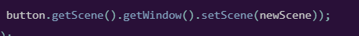

## Architecture and structure

---

10/02/2026

My biggest mistake so far was jumping right into the coding with minimal planning and after so clear flaws in my structure
given that it looked a mess and not a clear idea on scaling the project. After some research instead of writing the UI
in the code I should use FXML but use SceneBuilder to separate UI from backend process.

Also the approach of splitting the structure into modal, controller and view to better organise my code and maintability
over this course of creating this I believe however further research into this is needed.

# FXML Notes

--- 

# JavaFX notes

---
## Layout Planes

### - HBox
It is known as a horizontal box that sets all the nodes contained will be  out in a single 
horizontal row.

- **Box()** − It is the default constructor that constructs an HBox layout with 0 spacing.

- **HBox(double spacingVal)** − It constructs a new HBox layout with the specified spacing between nodes.

- **HBox(double spacingVal, Node nodes)** − This parameterized constructor of HBox class accepts children nodes as well as spacing between them and creates a new HBox layout with the specified components.

- **HBox(Node nodes)** − It creates an HBox layout with specified children nodes and 0 spacing.

properties and methods:
- fillHeight()
- setFillHeight()
- setSpacing()
- setPadding()

### Random Tips 

## How to change the scene 

One way that is considered bab practice is the image below; we get the *Window()* which is the direct ancestor to the 
Scene therefore we can set the scene from there and swap scenes from there.

Its back practice because in https://www.pragmaticcoding.ca/javafx/swap-scenes it says you should not

1. Don’t reach up into a parent.
2. Don’t peak inside a child.

## Good Sources
### JavaFX

https://moldstud.com/articles/p-javafx-project-hierarchy-tips-for-better-organization-streamline-your-development-process